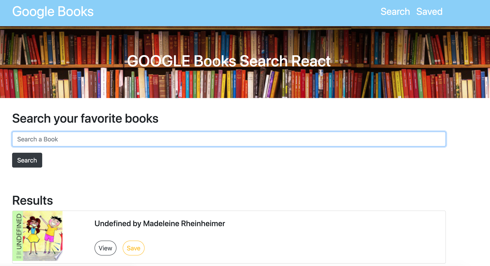

<h1 align="center">Welcome to Google Search Book 👋</h1>
<p>
  
  
  
  <a href="https://github.com/kefranabg/readme-md-generator#readme" target="_blank">
    
  </a>
  <a href="https://github.com/kefranabg/readme-md-generator/graphs/commit-activity" target="_blank">
    
  </a>
  <a href="https://github.com/kefranabg/readme-md-generator/blob/master/LICENSE" target="_blank">
    
  </a>
</p>

> Using Google API to search your favorite book and save it later.

### 🏠 [Homepage](https://github.com/Lihuor/google-book-search-react)

### ✨ [Demo](https://google-search-book-react.herokuapp.com/)




## Prerequisites

- npm >=6.14.8
- node >=12.18.1

## Install

```sh
npm install
```

## Usage

```sh
npm start
```

## Run tests

```sh
npm start
```

## Author

👤 **Lihuor Slot**

* GitHub: [@Lihuor](https://github.com/Lihuor)
* LinkedIn: [@https:\/\/www.linkedin.com\/in\/lihuor-slot\/](https://linkedin.com/in/https:\/\/www.linkedin.com\/in\/lihuor-slot\/)

## 🤝 Contributing

Contributions, issues and feature requests are welcome!<br />Feel free to check [issues page](https://github.com/kefranabg/readme-md-generator/issues). You can also take a look at the [contributing guide](https://github.com/kefranabg/readme-md-generator/blob/master/CONTRIBUTING.md).

## Show your support

Give a ⭐️ if this project helped you!

## 📝 License

Copyright © 2020 [Lihuor Slot](https://github.com/Lihuor).<br />
